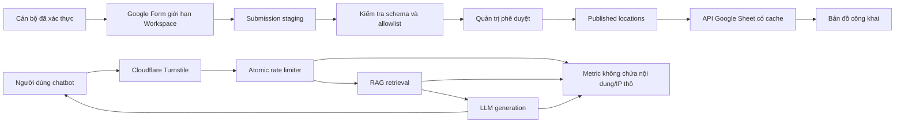

# KẾ HOẠCH KHẮC PHỤC VÀ NÂNG CẤP BANDOCAPT

## 1. Mục tiêu

Kế hoạch này chuyển các phát hiện trong `REPORT.md` thành backlog triển khai có thứ tự phụ thuộc, tiêu chí nghiệm thu và chiến lược rollout rõ ràng.

Mục tiêu cuối:

- Chỉ dữ liệu đã xác thực và phê duyệt mới xuất hiện trên bản đồ.
- Chatbot không thu thập dữ liệu cá nhân quá mức.
- Turnstile và rate limit không fail-open.
- Build/test/CI đủ khả năng ngăn regression trước khi deploy.
- Bản đồ nhanh, dễ đọc và điều hướng được bằng bàn phím.
- Chatbot trả lời có nguồn kiểm chứng, biết từ chối khi thiếu bằng chứng và gắn với chức năng bản đồ.

## 2. Nguyên tắc triển khai

1. Xử lý bảo mật và tính đúng dữ liệu trước tính năng mới.
2. Mỗi thay đổi bảo mật phải có negative test chứng minh request bị chặn.
3. Không thay đổi đồng thời toàn bộ data pipeline và chatbot trong một deployment duy nhất.
4. Mọi tính năng mới phải có telemetry tối thiểu, không chứa nội dung hội thoại hoặc dữ liệu cá nhân.
5. Preview dùng tài nguyên và secret riêng, không ghi vào production data.
6. Mọi rollout có feature flag hoặc đường rollback đã kiểm thử.

## 3. Kiến trúc đích



## 4. Lộ trình tổng thể

| Giai đoạn | Nội dung | Ước lượng | Điều kiện hoàn tất |
| --- | --- | --- | --- |
| 0 | Baseline, test harness và cấu hình môi trường | 1-2 ngày | Có CI tối thiểu và inventory biến môi trường |
| 1 | P0 bảo mật và toàn vẹn dữ liệu | 4-7 ngày | 4 finding bảo mật được đóng bằng test |
| 2 | Tính đúng dữ liệu, API và build quality | 4-6 ngày | Không còn tọa độ giả; build/test thật |
| 3 | Hiệu năng bản đồ và chatbot | 3-5 ngày | Marker/stream/RAG đạt ngân sách hiệu năng |
| 4 | Accessibility và giao diện | 3-5 ngày | Luồng chính dùng được bằng bàn phím/mobile |
| 5 | Tính năng chatbot và vận hành | 5-8 ngày | Citation, feedback, map integration và dashboard hoạt động |

Ước lượng trên là ngày công kỹ thuật, chưa bao gồm thời gian phê duyệt Google Workspace, pháp chế hoặc nội dung nghiệp vụ.

## 5. Giai đoạn 0 - Baseline và hàng rào phát hành

### G0-01 - Chốt snapshot và phạm vi thay đổi

**Công việc:**

- Tạo branch triển khai riêng từ trạng thái chatbot hiện tại.
- Commit riêng phần thay chatbot trước khi bắt đầu hardening.
- Ghi lại cấu hình production hiện có nhưng không đưa giá trị secret vào repository.
- Tạo checklist tài nguyên: Vercel project, Cloudflare widget, Firebase project, Pinecone index và Google Sheet/Form.

**Tiêu chí nghiệm thu:**

- Có commit baseline tái tạo được.
- `git status` sạch trước mỗi nhóm thay đổi.
- Mỗi tài nguyên production có owner và mục đích rõ ràng.

### G0-02 - Chuẩn hóa scripts

**Tệp dự kiến:** `package.json`, `tailwind.config.js`

**Công việc:**

- Thêm scripts: `lint`, `typecheck` hoặc `check`, `test`, `test:integration`, `test:e2e`, `build`.
- Mở rộng Tailwind content thành `./*.html`, `./*.js`, `./js/**/*.js`.
- Build phải compile `input.css` thành CSS minified.
- Thêm syntax check cho toàn bộ JS runtime.

**Tiêu chí nghiệm thu:**

- `npm run build` tạo artifact thực tế và thất bại khi mã sai syntax.
- `npm test` chạy test thật và trả exit code 0 khi đạt.
- Không phụ thuộc vào file CSS build thủ công không kiểm chứng.

### G0-03 - Thiết lập CI

**Công việc:**

- Tạo workflow cho pull request.
- Chạy install cố định bằng `npm ci`.
- Chạy lint/check, unit test, integration test, build và audit report.
- Chạy secret scan và kiểm tra file artifact ngoài ý muốn.
- Lưu test report và coverage.

**Gate ban đầu:**

- Không cho merge nếu syntax/build/test thất bại.
- Không cho merge nếu xuất hiện vulnerability High/Critical mới.
- Moderate được phép có thời hạn nếu có issue và owner.

## 6. Giai đoạn 1 - Bảo mật và toàn vẹn dữ liệu

### G1-01 - Xây dựng luồng staging và approval cho dữ liệu bản đồ

**Liên quan:** SEC-01 (combo với COR-01)
**Tệp dự kiến:** `setup/tao-form-thu-thap.js`, script Apps Script mới, `app.js`, `api/google-sheet.js`

> **Combo P0 với COR-01.** SEC-01 và COR-01 cùng tạo ra rủi ro "trụ sở Công an giả ở vị trí trông hợp lý" và phải được nhìn như một. Fix nhẹ của COR-01 (bỏ `Math.random()` tại `app.js:653-654`, tọa độ không hợp lệ → không tạo marker) là **quick win làm ngay**, không cần chờ luồng staging/approval (phần nặng) của G1-01 hoàn thiện. Xem chi tiết COR-01 ở **G2-01** — nhưng phần "bỏ tọa độ ngẫu nhiên" được kéo lên P0 cùng G1-01, phần validation range/bounding box còn lại để ở G2-01.

**Thiết kế:**

- `Form_Responses`: dữ liệu thô, không bao giờ được frontend đọc.
- `Location_Staging`: dữ liệu đã normalize và có validation result.
- `Published_Locations`: chỉ chứa bản ghi được phê duyệt.
- Trường bắt buộc: `record_id`, `unit_code`, `submitter_email`, `status`, `reviewed_by`, `reviewed_at`, `updated_at`.

**Công việc:**

1. Giới hạn Form cho Workspace hoặc nhóm tài khoản được phép.
2. Tạo allowlist email -> mã đơn vị.
3. Kiểm tra người gửi chỉ được cập nhật đơn vị của mình.
4. Validate tên đơn vị, phone, URL ảnh và tọa độ.
5. Tạo thao tác approve/reject dành cho quản trị.
6. Chuyển website sang đọc `Published_Locations`.
7. Thêm audit log bất biến cho phê duyệt và sửa đổi.

**Test bắt buộc:**

- Email không có trong allowlist không tạo published record.
- Email đơn vị A không thể cập nhật đơn vị B.
- Submission hợp lệ vẫn không xuất hiện trước khi approve.
- Reject không làm thay đổi dữ liệu đang công khai.
- Revoke một bản ghi sẽ loại marker khỏi lần refresh kế tiếp.

**Tiêu chí nghiệm thu:**

- Không còn chuỗi `fetchSheetData("Form_Responses")` trong frontend/runtime public.
- Mỗi marker truy ngược được tới người gửi và người duyệt.
- Có quy trình rollback một bản ghi sai trong dưới 10 phút.

### G1-02 - Tối thiểu hóa telemetry chatbot

**Liên quan:** SEC-02
**Tệp dự kiến:** `api/chat.js`, tài liệu privacy/operations

**Schema metric mới đề xuất:**

```json
{
  "request_id": "random-id",
  "timestamp": "server-time",
  "status": "ok|error|blocked",
  "model": "model-name",
  "latency_ms": 0,
  "retrieval_count": 0,
  "finish_reason": "",
  "error_code": "",
  "ip_bucket_hash": "optional-short-lived"
}
```

**Công việc:**

- Xóa `question`, `answer` và IP plaintext khỏi payload mặc định.
- Xóa hardcoded RTDB URL và fallback cross-project.
- Chỉ bật diagnostic content logging bằng flag có expiry và sampling.
- Không log diagnostic ở Production nếu chưa có privacy approval.
- Thiết lập retention tự động cho metric và diagnostic collection riêng.
- Thêm endpoint/quy trình xóa dữ liệu khi cần.

**Test bắt buộc:**

- Snapshot telemetry không chứa question, answer hoặc IP.
- Firestore lỗi không tạo request sang RTDB khác.
- Log sanitizer loại token, email, số hộ chiếu và credential pattern.
- Retention job xóa đúng bản ghi hết hạn.

### G1-03 - Turnstile fail-closed

**Liên quan:** SEC-03
**Tệp dự kiến:** `api/chat.js`, `index.html`, `js/chatbot.js`, cấu hình Vercel

**Công việc:**

- Thay `if (!secret) return true` bằng lỗi cấu hình production.
- Validate response `success`, `hostname`, `action` và token age nếu dữ liệu có sẵn.
- Reset token sau mỗi lần sử dụng.
- Khi widget lỗi, khóa input và cung cấp nút retry rõ ràng.
- Không bật lại input trong nhánh catch nếu chưa có token mới.
- Di chuyển site key vào config public theo môi trường thay vì fallback hardcode nhiều nơi.

**Cấu hình Cloudflare:**

- Tạo widget riêng cho `bandocapt` production.
- Allowed hostname chỉ gồm domain production thực tế.
- Dùng test key chính thức cho local/E2E.
- Preview dùng widget riêng hoặc danh sách hostname Preview được quản lý.
- Secret production chỉ có ở Vercel Production.

**Test bắt buộc:**

- Thiếu secret ở Production -> build/deploy fail hoặc API trả 503, không gọi LLM.
- Thiếu token -> 403.
- Token sai hostname/action -> 403.
- Token hợp lệ -> một request thành công; reuse token -> thất bại.

### G1-04 - Thay rate limit bằng reservation atomic

**Liên quan:** SEC-04
**Tệp dự kiến:** `api/chat.js`, module limiter mới

**Thiết kế ưu tiên:**

- Dùng một store phù hợp serverless và có atomic increment/transaction.
- Key không chứa IP plaintext; dùng HMAC IP với salt riêng.
- Có ba lớp: burst/minute, daily identity/IP bucket và monthly global budget.
- Reserve quota trước provider call; hoàn trả hoặc ghi outcome theo chính sách rõ ràng.

**Công việc:**

1. Tách limiter thành module độc lập.
2. Kiểm tra storage health và quyền truy cập.
3. Await kết quả reserve trước embedding/LLM.
4. Fail-closed hoặc bounded-degradation khi store lỗi.
5. Cấu hình provider budget cap.
6. Thêm alert cho limiter failure và quota threshold.

**Test bắt buộc:**

- GET/transaction trả 401, 403, 429, 500 hoặc timeout -> không gọi LLM.
- 50 request đồng thời không vượt limit đã định.
- Counter không bị lost update.
- Log không chứa IP thô.

### G1-05 - Dependency hardening

> **Hiện trạng đã xác minh:** DOMPurify 3.0.6 và Marked 15.0.7 tại `index.html:258-259` **đã được pin version + có `integrity` (SRI) + `crossorigin`**. Việc "khóa version" và "duy trì SRI" coi như đã xong cho 2 script này; phạm vi G1-05 thu hẹp lại còn **bump version + cập nhật hash**.

**Công việc:**

- Nâng version DOMPurify (và rà Marked) lên phiên bản vá phù hợp; **cập nhật lại `integrity` hash** sau khi đổi version.
- Giữ nguyên tắc pin + SRI cho mọi script production thêm mới (đã áp dụng cho 2 script hiện tại — không cần làm lại).
- Đánh giá nâng `firebase-admin` theo release notes và test integration.
- Bật bot cập nhật dependency.
- Tạo issue cho từng Moderate chưa xử lý.

**Tiêu chí nghiệm thu:**

- DOMPurify không còn trong affected range đã biết, `integrity` hash khớp version mới.
- Không dùng `npm audit fix --force` nếu chưa review diff và test.
- Không có High/Critical trong production dependency tree.

## 7. Giai đoạn 2 - Dữ liệu, API và chất lượng phát hành

### G2-01 - Validation tọa độ và dữ liệu địa điểm

**Liên quan:** COR-01
**Lưu ý:** phần "bỏ `Math.random()` / không tạo tọa độ ngẫu nhiên" đã được kéo lên **P0** (ship cùng G1-01). G2-01 là phần còn lại: validation đầy đủ và data-quality report.

**Công việc:**

- Tạo `parseCoordinates()` thuần, có unit test.
- Hỗ trợ format tọa độ và URL Google Maps được xác định rõ.
- Kiểm tra latitude `[-90,90]`, longitude `[-180,180]` và bounding box địa phương.
- Không tạo tọa độ ngẫu nhiên (đã loại ở P0 — đảm bảo không bị tái xuất hiện qua test).
- Bản ghi lỗi bị loại và đưa vào data-quality report.

**Tiêu chí nghiệm thu:**

- Không có `Math.random()` trong đường tạo marker.
- 100% marker có tọa độ đã validate.
- Dataset lỗi có mã lỗi cụ thể, không im lặng bỏ qua.

### G2-02 - Hợp nhất Google Sheet API

**Liên quan:** COR-02, COR-03

**Công việc:**

- Chuyển `api/google-sheet.js` sang CommonJS để đồng bộ dự án.
- Frontend gọi `/api/google-sheet?sheet=Published_Locations`.
- Server validate allowlist sheet và schema response.
- Thêm timeout, retry có giới hạn và lỗi chuẩn hóa.
- Dùng `s-maxage`/`stale-while-revalidate` riêng cho endpoint này.
- Giữ `/api/chat` ở `no-store`.

**Test bắt buộc:**

- Sheet ngoài allowlist -> 400.
- Thiếu env -> lỗi cấu hình không lộ chi tiết.
- Google timeout/invalid payload -> 502 có schema ổn định.
- Cache header của Sheet và Chat không xung đột.

### G2-03 - Trạng thái dữ liệu trên UI

**Công việc:**

- Loading skeleton hoặc progress nhỏ, không che toàn bộ bản đồ.
- Empty state khác với error state.
- Retry button.
- Last-updated timestamp và stale warning.
- Last-known-good cache có version/schema.

**Tiêu chí nghiệm thu:**

- Mọi lỗi mạng đều có thông báo người dùng và retry.
- Dữ liệu cache cũ được gắn nhãn, không trình bày như dữ liệu mới.

### G2-04 - Bộ test nền

**Stack đề xuất:** Vitest hoặc Node test runner cho unit/integration; Playwright cho E2E; axe-core cho accessibility.

**Coverage tối thiểu ban đầu:**

| Module | Mục tiêu |
| --- | --- |
| Parser/validation dữ liệu | >= 90% branch |
| Turnstile và rate limiter | 100% nhánh allow/deny/failure quan trọng |
| Chat stream parser | >= 85% branch |
| UI map/chat luồng chính | E2E desktop và mobile |

Không đặt coverage toàn repository quá cao ngay từ đầu; ưu tiên kiểm soát có rủi ro cao.

## 8. Giai đoạn 3 - Hiệu năng

### G3-01 - Marker clustering và render theo viewport

**Công việc:**

- Đưa marker vào cluster layer.
- Tách `locations` khỏi marker object.
- Cập nhật cluster theo tập ID thay đổi.
- Chỉ fit bounds khi người dùng chủ động chọn nearby/search result.
- Kiểm tra 145, 1.000 và 5.000 bản ghi giả lập.

**Ngân sách nghiệm thu:**

- 145 bản ghi: tương tác filter/search không block main thread quá 50 ms.
- 1.000 bản ghi: bản đồ vẫn pan/zoom mượt trên mobile trung bình.
- Marker không che kín bản đồ ở zoom tỉnh/thành phố.

### G3-02 - Tối ưu search/filter

**Công việc:**

- Normalize text tiếng Việt một lần khi nạp dữ liệu.
- Dùng index nhẹ theo name/address/type nếu dữ liệu tăng.
- Diff visible IDs thay vì gọi `map.hasLayer()` cho mọi marker.
- Virtualize danh sách nếu vượt ngưỡng thực tế.

### G3-03 - Stream rendering và cancel

**Công việc:**

- Duy trì AbortController tới event `done`.
- Thêm request timeout và idle-chunk timeout.
- Thêm nút Stop.
- Trong lúc stream cập nhật plain text theo throttle 50-100 ms.
- Chạy Marked + DOMPurify một lần khi hoàn tất.

**Test bắt buộc:**

- Stream không có chunk trong khoảng timeout -> abort và UI phục hồi.
- Người dùng nhấn Stop -> network reader bị cancel.
- Đóng chatbot khi stream -> không còn DOM update pending.
- Response dài không tạo long task đáng kể.

### G3-04 - Giảm latency RAG

**Công việc:**

- Chỉ dùng namespace được cấu hình; validate khi deploy.
- Đặt timeout riêng cho embedding, retrieval, rerank và generation.
- Bypass rerank nếu top score/margin đạt ngưỡng đã đánh giá.
- Cache embedding và retrieval theo hash + `kb_version`.
- Thu thập percentile p50/p95 cho từng stage.

**Ngân sách ban đầu đề xuất:**

| Giai đoạn | p95 mục tiêu |
| --- | --- |
| Embedding | <= 1,5 giây |
| Pinecone retrieval | <= 1 giây |
| Rerank | <= 1,5 giây |
| Time to first token tổng | <= 4 giây |

Ngân sách cần hiệu chỉnh sau khi có dữ liệu production thực tế.

## 9. Giai đoạn 4 - Accessibility và giao diện

### G4-01 - Danh sách kết quả truy cập được bằng bàn phím

**Công việc:**

- Đổi result item thành `button` hoặc pattern listbox hoàn chỉnh.
- Hỗ trợ Tab, Enter và Space.
- Focus-visible có tương phản đạt chuẩn.
- Cập nhật `aria-live` cho số kết quả.
- Không dùng `role="application"` cho map nếu chưa triển khai đầy đủ keyboard model.

### G4-02 - Panel chi tiết

**Công việc:**

- Heading hierarchy hợp lý.
- Nút gọi điện/chỉ đường có accessible name.
- Trả focus về kết quả đã chọn khi đóng.
- Panel mobile không che các thao tác quan trọng.

### G4-03 - Chatbot dialog

**Công việc:**

- Desktop: popover/non-modal có semantics đúng.
- Mobile thấp hơn breakpoint xác định: full-screen dialog.
- Escape để đóng, focus trap khi modal và trả focus về toggle.
- Ẩn toggle khi dialog full-screen đang mở.
- Trạng thái Turnstile/error được thông báo bằng live region phù hợp.

### G4-04 - Attribution và visual cleanup

**Công việc:**

- Bật lại OpenStreetMap attribution.
- Giảm clutter marker bằng cluster và ưu tiên marker được chọn.
- Đảm bảo text không tràn ở 320 px.
- Đặt `letter-spacing: 0` cho các style đang dùng giá trị âm.
- Kiểm tra contrast, zoom 200% và reduced motion.

**Tiêu chí nghiệm thu accessibility:**

- Không có lỗi axe mức serious/critical trong luồng chính.
- Hoàn thành tìm kiếm -> mở chi tiết -> đóng chỉ bằng bàn phím.
- Hoàn thành mở chat -> gửi -> dừng -> đóng chỉ bằng bàn phím.
- UI hoạt động ở zoom trình duyệt 200% và viewport 320 px.

## 10. Giai đoạn 5 - Nâng cấp tính năng chatbot

### G5-01 - Citation kiểm chứng được

**Thiết kế metadata nguồn:**

- `document_id`
- `title`
- `article`
- `official_url`
- `effective_date`
- `last_verified_at`
- `kb_version`

**Công việc:**

- Chỉ cho phép URL từ domain văn bản chính thức trong allowlist.
- Citation chip trở thành link.
- Hiển thị ngày hiệu lực/cập nhật.
- Kiểm tra citation có thực sự hỗ trợ câu trả lời.

### G5-02 - Không trả lời khi bằng chứng yếu

**Công việc:**

- Bỏ fallback tự động lấy top 3 dưới threshold.
- Xác định threshold theo evaluation dataset, không chỉ cảm tính.
- Khi bằng chứng yếu, trả lời giới hạn và hướng dẫn liên hệ.
- Không để model tự bịa URL hoặc điều khoản.

**Metric:**

- Citation precision.
- Grounded answer rate.
- Unsupported claim rate.
- Safe refusal accuracy.

### G5-03 - Versioned cache

**Công việc:**

- Cache key gồm normalized question, language, model, `kb_version`, `prompt_version`.
- Không cache câu hỏi có PII pattern hoặc history cá nhân.
- Purge cache khi knowledge base thay đổi.
- Ghi cache hit/miss bằng metric tổng hợp.

### G5-04 - Feedback backend

**Công việc:**

- Tạo `/api/chat-feedback` riêng.
- Payload chỉ chứa response/request ID, rating và reason category.
- Nội dung tự do là optional và có consent rõ.
- Rate limit và Turnstile phù hợp.
- Dashboard thống kê lỗi nguồn, câu trả lời không hữu ích và latency.

### G5-05 - Tích hợp chatbot với bản đồ

**Use case ưu tiên:**

1. “Cơ quan gần tôi nhất ở đâu?”
2. “Làm thủ tục X ở đơn vị nào?”
3. “Mở đường đi tới đơn vị này.”
4. “Số điện thoại và giờ làm việc của đơn vị.”

**Thiết kế:**

- Chatbot trả về `location_id` có schema, không trả HTML thao tác tùy ý.
- Frontend ánh xạ ID sang dữ liệu `Published_Locations` đã xác thực.
- Người dùng phải nhấn hành động rõ ràng trước khi map đổi vị trí.
- Không cho LLM tự tạo tọa độ hoặc số điện thoại.

## 11. Observability và vận hành

### Metric bắt buộc

- API request count theo status/error code.
- Turnstile pass/fail/config-error.
- Rate limiter allow/deny/store-error.
- LLM request count, token/cost estimate và provider error.
- Embedding/retrieval/rerank/generation latency.
- Google Sheet fetch success/stale/error.
- Số submission pending/approved/rejected.
- Số location bị data validation loại.

### Alert đề xuất

- Turnstile config error > 0 ở Production.
- Limiter storage error > 1% trong 5 phút.
- Provider quota đạt 70%, 85%, 95%.
- Sheet data stale quá ngưỡng vận hành.
- Tăng đột biến submission hoặc feedback xấu.

Không đưa question, answer, raw IP, email hoặc số hộ chiếu vào metric label/log mặc định.

## 12. Ma trận biến môi trường

| Biến | Production | Preview | Local/Test | Ghi chú |
| --- | --- | --- | --- | --- |
| `GEMINI_API_KEY` | Bắt buộc | Key/quota riêng | Key test | Không dùng chung quota nếu có thể |
| `DEEPSEEK_API_KEY` | Tùy chọn | Tùy chọn | Tùy chọn | Fallback phải được giám sát |
| `PINECONE_API_KEY` | Bắt buộc nếu bật RAG | Index/namespace riêng | Test index | Không fallback qua nhiều namespace |
| `FIREBASE_SERVICE_ACCOUNT_JSON` | Bắt buộc nếu dùng Firestore | Project riêng | Emulator/test project | Ưu tiên một cách cấu hình duy nhất |
| `FIREBASE_DB_URL` | Chỉ khi thật sự cần | Riêng | Emulator | Loại bỏ hardcoded URL |
| `FIREBASE_DB_SECRET` | Tránh dùng legacy secret | Không dùng chung | Không production secret | Xem xét loại bỏ hoàn toàn |
| `TURNSTILE_SECRET_KEY` | Bắt buộc | Widget riêng | Test secret | Thiếu phải fail-closed |
| Public Turnstile site key | Widget production | Widget preview | Test key | Site key không phải secret |
| `ALLOWED_ORIGINS` | Domain production | Preview domains được quản lý | localhost | Không dùng `*` |
| `GOOGLE_SHEET_ID` | Published dataset | Dataset test | Fixture/test sheet | Không đọc raw responses |
| `CHAT_LOG_HASH_SALT` | Secret riêng, xoay vòng | Riêng | Test value | Không fallback sang DB secret |
| `EVAL_BYPASS_TOKEN` | Không được tồn tại | Chỉ môi trường đánh giá kiểm soát | Có thể dùng | Có expiry/rotation |

## 13. Chiến lược rollout

### Đợt 1 - Security-only

- Deploy Turnstile fail-closed, rate limiter mới và telemetry tối thiểu.
- Feature flag chatbot mới nếu cần rollback nhanh.
- Theo dõi 24-48 giờ trước đợt tiếp theo.

### Đợt 2 - Data publication

- Backfill dữ liệu hiện tại sang `Published_Locations`.
- Kiểm tra thủ công mẫu dữ liệu và số marker.
- Chuyển API/frontend sang nguồn mới bằng flag.
- Giữ raw Form read path chỉ để rollback trong thời gian ngắn, không public.

### Đợt 3 - Performance và UI

- Bật clustering, stream rendering mới và accessibility fixes.
- So sánh Web Vitals, error rate và completion rate trước/sau.

### Đợt 4 - Chatbot features

- Bật citation links, feedback và map integration theo tỷ lệ người dùng.
- Chỉ mở rộng khi evaluation và telemetry đạt ngưỡng.

## 14. Kế hoạch rollback

- Mỗi migration dữ liệu phải giữ bản backup có timestamp.
- Không rollback về đường đọc raw `Form_Responses` công khai.
- Chatbot có feature flag để tắt provider call và hiển thị thông báo bảo trì.
- Nếu limiter lỗi sau deploy, chuyển endpoint sang 503 có kiểm soát thay vì bỏ limiter.
- Nếu citation/RAG lỗi, chuyển sang safe refusal hoặc FAQ tĩnh đã duyệt.
- Rollback không được khôi phục logging question/answer/IP thô.

## 15. Definition of Done chung

Một task chỉ được coi là hoàn thành khi:

1. Mã đã được review và không chứa secret.
2. Có test cho happy path, deny path và failure path liên quan.
3. Build/CI pass từ clean checkout.
4. Có logging/metric cần thiết nhưng không thu thập dữ liệu quá mức.
5. Có tài liệu biến môi trường hoặc migration nếu thay đổi vận hành.
6. Đã kiểm tra desktop, mobile và keyboard nếu tác động UI.
7. Có phương án rollback đã thử trên Preview.
8. Các tiêu chí nghiệm thu riêng của task đều đạt.

## 16. Checklist phát hành cuối

> Kiểm toán code local ngày 2026-06-27. Dấu hoàn thành chỉ chứng minh tiêu chí trong repository;
> pipeline Google Workspace, biến môi trường Production và rollback Preview vẫn cần xác minh vận hành.

- [x] Website chỉ đọc `Published_Locations` hoặc API tương đương.
- [x] Không còn tọa độ ngẫu nhiên.
- [x] Không log question, answer hoặc IP thô mặc định.
- [x] Không còn Firebase RTDB URL hardcode.
- [x] Thiếu Turnstile secret làm deployment/request fail-closed.
- [ ] Rate limiter atomic và storage failure không gọi LLM.
- [ ] `EVAL_BYPASS_TOKEN` không tồn tại ở Production.
- [x] DOMPurify đã được nâng khỏi affected range.
- [x] `npm test` và `npm run build` chạy kiểm tra thật.
- [x] API Google Sheet và package module format thống nhất.
- [ ] Marker clustering hoạt động trên mobile.
- [ ] Stream có timeout toàn thời gian và nút Stop.
- [ ] Danh sách, panel và chatbot dùng được bằng bàn phím.
- [x] OpenStreetMap attribution hiển thị.
- [ ] Citation dẫn tới nguồn chính thức đã allowlist.
- [ ] Dashboard/alert không chứa dữ liệu cá nhân.
- [ ] Rollback đã được thử trên Preview.
